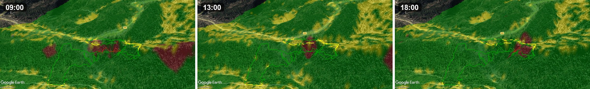

***English** | [Français](README.fr.md)*

# gpxsolar

### Will I be in sun or shade on my hike?

gpxsolar casts a ray toward the sun from **every point** of a GPX track and
tests it against the terrain **and** the vegetation (0.5 m HD LiDAR / IGN), for a
given date and time. It tells you, meter by meter, sun or shade.


> *Will I be in sun or shade on my hike?* gpxsolar ray-traces the sun against
> terrain **and** vegetation (0.5 m LiDAR) along a GPX track, for a given date
> and time — point by point, sun or shade.

**Outputs: KMZ (Google Earth), MBTiles overlay + KML track (Locus Map / OsmAnd) and CSV.**

A self-contained Python tool that takes a GPX track, a start date and time, then
computes for each point of the route whether it is in sun or shade, accounting
for the terrain (digital elevation model) and the vegetation (ESA WorldCover). It
produces a colorized KML/KMZ to open in Google Earth and a CSV summary.

> ⚠️ **Status**: personal project, publicly released. Developed and tested on
> Windows 10/11. Linux and macOS are supported by the build architecture but
> tested partially — known cases + cross-OS troubleshooting in the
> *Troubleshooting* section of [BUILD.md](BUILD.md). Feedback welcome via
> [GitHub issues](https://github.com/nico579/gpxsolar/issues).

---

## What it produces

From a GPX file + date/time:

- **Sun-exposure profile** along the track: each point is classified
  *sun* / *shade* by simulating the sun's position (azimuth + altitude via
  `pysolar`) and casting a ray against the terrain and the canopy.
- **Relief shadows** from a DEM, with several elevation sources to choose from:
  - **SRTM1 / Copernicus DEM** — global, low/medium resolution
  - **IGN BD ALTI 25 m** — France, medium resolution
  - **IGN RGE ALTI 5 m** — France, high resolution
  - **IGN LiDAR HD 0.5 m** — France, very high resolution (DTM, DSM, CHM)
- **Vegetation shadows** via ESA WorldCover (estimated canopy height), which can
  be disabled.
- **Outputs**: colorized KMZ (Google Earth), **MBTiles** overlay + **KML** track
  for smartphone GPS apps (Locus Map, OsmAnd…), and an aggregated CSV. Optional
  timestamped waypoints along the route.
  Details of the files and smartphone overlay: see
  [Output files](#output-files--smartphone-overlay).

---

## Installation and usage

Two ways to use gpxsolar:

| | **A. Python script** | **B. Standalone executable** |
|---|---|---|
| **Requirements** | Python 3.12 | None |
| **First install** | ~5 min (deps bootstrap) | None |
| **Updates** | `git pull` + relaunch | Patch the bundle in one command: `python update_app.py` (or `--release` for all 3 OSes — see [`update_app.py`](update_app.py)) |
| **Distributable** | No — each user installs Python | Yes — `.exe` / `.app` / Linux binary + `gpxsolar_bundle.zip` side by side |
| **Best for** | dev / Linux / contributing | end user / distributing |

### A. Python script

On first launch, the script creates `~/.gpxsolar/venv` and installs its
dependencies there (numpy, pyproj, rasterio, shapely, pysolar, pywebview + PyQt6/QtWebEngine,
simplekml, timezonefinder, gpxpy, pandas…). ~300-400 MB, **once**.

#### Windows 10+
```powershell
git clone https://github.com/nico579/gpxsolar
cd gpxsolar
python gpxsolar.py
```

#### macOS 11+
```bash
brew install python@3.12
git clone https://github.com/nico579/gpxsolar
cd gpxsolar
python3.12 gpxsolar.py
```

#### Linux (Debian / Ubuntu)
```bash
sudo apt install python3.12 python3.12-venv git
git clone https://github.com/nico579/gpxsolar
cd gpxsolar
python3.12 gpxsolar.py
```

Bootstrap modes: `--bootstrap=auto` (default, isolated venv), `--bootstrap=pip`
(install into the current Python), `--bootstrap=none` (check only),
`--help-bootstrap` (help).

### B. Standalone executable

No Python for the end user to install. The deliverable carries its own runtime
(embedded Python + dependencies).

#### 1. Get the deliverable

**Option a — Download from [Releases](https://github.com/nico579/gpxsolar/releases)**:

| OS | Archive | Extract with |
|----|---------|--------------|
| Windows 10/11 (x86_64) | `gpxsolar-windows-x86_64.zip` | `Expand-Archive` or double-click |
| Linux Ubuntu 24.04+ (x86_64) | `gpxsolar-linux-x86_64.tar.gz` | `tar xzf` |
| macOS 12+ (Apple Silicon) | `gpxsolar-macos-arm64.zip` | `unzip` then `xattr -dr com.apple.quarantine GPXSOLAR.app` |

The archive contains the binary/launcher and its `gpxsolar_bundle.zip` side by side.

**Option b — Build it yourself.** A machine setup script (do **once**) then a
build script (re-run each time `gpxsolar.py` is updated).

##### Windows
```powershell
git clone https://github.com/nico579/gpxsolar
cd gpxsolar
.\setup_build_windows.ps1     # 1. Setup: Python 3.12, deps, PyInstaller
.\gpxsolar_win_build.ps1      # 2. Build -> dist\gpxsolar.exe + dist\gpxsolar_bundle.zip
```

##### macOS (Apple Silicon)
```bash
git clone https://github.com/nico579/gpxsolar
cd gpxsolar
bash setup_build_mac.sh       # 1. Setup
bash gpxsolar_mac_build.sh    # 2. Build -> dist/GPXSOLAR.app + dist/gpxsolar-macos-arm64.zip
```

##### Linux (Ubuntu / Debian)
Linux reuses the `gpxsolar_win.spec` spec (PyInstaller produces an ELF on Linux —
the `_win` name is misleading).
```bash
git clone https://github.com/nico579/gpxsolar
cd gpxsolar
bash setup_build_linux.sh       # 1. Setup
bash gpxsolar_linux_build.sh    # 2. Build -> dist/gpxsolar + dist/gpxsolar_bundle.zip
```

Full build documentation (bundle architecture, updating without rebuild,
troubleshooting): **[BUILD.md](BUILD.md)**.

#### 2. Run the deliverable

| OS | Command |
|----|---------|
| Windows | Double-click `gpxsolar.exe` (or a terminal to see the log) |
| Linux | `chmod +x gpxsolar && ./gpxsolar` in the extracted folder |
| macOS | Double-click `GPXSOLAR.app`. First launch blocked by Gatekeeper: `xattr -dr com.apple.quarantine GPXSOLAR.app` then double-click |

The first launch extracts the bundle (~20-30 s, once — it contains Qt) into:
- Windows: `%LOCALAPPDATA%\gpxsolar\`
- macOS: `~/Library/Application Support/gpxsolar/`
- Linux: `~/.local/share/gpxsolar/`

Clean uninstall: `gpxsolar(.exe) --desinstaller` (removes the extracted bundle
+ the venv).

---

## Usage

Two modes, selected automatically based on the arguments (same logic as the twin
project [lidar2map](https://github.com/nico579/lidar2map)):

- **No argument → graphical interface** (pywebview). The common mode.
- **With arguments → command-line computation** (headless, no window).
  Handy for scripting, running on a server, or reproducing an exact render.

### Graphical interface mode (no argument)

| Platform | Launch |
|---|---|
| **Windows** | double-click **`gpxsolar.exe`** (or a terminal to see the log) |
| **Linux** | **`./gpxsolar`** in the extracted folder |
| **macOS** | double-click **`GPXSOLAR.app`** |
| Script (dev) | `python gpxsolar.py` |

Then in the window:
1. Choose a **GPX** file.
2. Select the **date** and **start time**.
3. Choose an **elevation source**: SRTM/Copernicus (global), IGN ALTI
   (France), IGN LiDAR HD (France, DTM/DSM/CHM).
4. Set the options (shadow type, vegetation, analysis resolution).
5. **Run the computation** → KML/KMZ + CSV.

### Command-line mode (headless)

As soon as you pass an argument, gpxsolar computes **without opening a window** and
writes the outputs into `GPX_Ombres/` (KMZ / MBTiles / KML depending on the options —
see [Output files](#output-files--smartphone-overlay)), plus the CSV. The minimum required is
`--gpx` + `--date` (DD/MM/YYYY) + `--time` (HH:MM). Everything below applies to the
binary as well as the script — just replace `gpxsolar.exe` with
`./gpxsolar` (Linux) or `python gpxsolar.py` (dev).

The three commands below reproduce exactly the three Google Earth renders in the
[Screenshots](#screenshots) section:

```powershell
# 1) Colored sun / shade track (basic render)
gpxsolar.exe --gpx hike.gpx --date 21/06/2024 --time 09:00 --dem-source ign_lidar_hd

# 2) + base map (raster shadow map in KMZ)
gpxsolar.exe --gpx hike.gpx --date 21/06/2024 --time 09:00 --dem-source ign_lidar_hd `
             --generate-shadow-map

# 3) + simulated sun rays
gpxsolar.exe --gpx hike.gpx --date 21/06/2024 --time 09:00 --dem-source ign_lidar_hd `
             --generate-shadow-map --visualize-sun-rays --sun-ray-interval 20
```

> The backtick `` ` `` is the PowerShell line continuation. On Linux/macOS,
> use `\` or put everything on a single line.

---

## Output files & smartphone overlay

All outputs land in `GPX_Ombres/`. The `<base>` prefix encodes the GPX, the date,
the time, the elevation source, the shadow type and the direction.

**Without `--generate-shadow-map`** (track only):

| File | Content | For |
|---|---|---|
| `<base>.kml` | colored sun/shade track (vector) | Google Earth, Locus, OsmAnd, QGIS |

**With `--generate-shadow-map`** (track + shadow map) — three files, one per use:

| File | Content | For |
|---|---|---|
| `<base>.kmz` | **all-in-one**: colored track **+** shadow map | **Google Earth** (desktop) |
| `<base>.mbtiles` | shadow map only, **raster overlay** (PNG tiles, Web Mercator) | **Locus Map / OsmAnd / OruxMaps / QGIS** |
| `<base>_trace.kml` | colored track only (vector) | **Locus Map / OsmAnd** (as a *track*) |

Plus the **CSV** summary (`analyse_solaire.csv` by default), one line per run.

### Why three files and not just one

Google Earth reads the **KMZ** (shadow image + track merged) without trouble. But
smartphone apps handle the KML GroundOverlay poorly: so we give them the shadow
map as **MBTiles** (the raster overlay standard they can all display) and the
track as a separate **KML**.

### Overlaying shadow + track on a smartphone (Locus Map, OsmAnd)

The instinct "I can only enable **one** map overlay" is correct — but a GPS app
has **three independent layers**:

1. the **base map** (topo, satellite…);
2. **one** map overlay on top → that's the shadow **`.mbtiles`**;
3. as many **tracks/routes** as you want → that's the **`_trace.kml`**.

A *track* is **not** a "map": it doesn't count toward the single-overlay limit.
So you load the shadow **and** the track as **two layers of different kinds**, and
they display together.

**Locus Map:**
- *Shadow*: copy `<base>.mbtiles` into `Locus/mapItems/` (or `Locus/maps/`), then
  enable it as an **overlay** (map manager → overlay button).
  **Leave the layer opacity at 100 %** (see the note below).
- *Track*: **import** `<base>_trace.kml` → it appears as a **track**, crisp and
  clickable, on top of the overlay.

**OsmAnd:**
- *Shadow*: *Configure map → Overlay map layer* → choose the `.mbtiles`.
  **Leave the layer transparency at maximum / at 0 %.**
- *Track*: *My Places / Tracks* → **import** the `.kml` (or `.gpx`).

> **Leave the layer opacity at 100 % in Locus/OsmAnd.** The semi-transparency is
> already **baked into the tiles** (the shadow lets the topo base show through) —
> nothing to adjust. Lowering the **layer** opacity only emphasizes a Locus
> artifact.
>
> **Faint tile seams in Locus:** Locus draws the tiles of a semi-transparent
> overlay with a slight overlap, which leaves **thin lines** at the tile edges.
> This is a **Locus rendering limitation** (format-independent: MBTiles, RMAP or
> SQLitedb all show the same), not a data defect — the tiles are pixel-perfectly
> contiguous. **QGIS and Google Earth render seamlessly.** For GIS, prefer the
> GeoTIFF (EPSG:2154) or the MBTiles opened in QGIS anyway.

Main options (full list: `gpxsolar.exe --help`):

```
--gpx PATH                       # GPX file (triggers command-line mode)
--date DD/MM/YYYY --time HH:MM   # start date and time
--dem-source {srtm1,copernicus,ign_bdalti_25m,ign_rgealti_5m,ign_lidar_hd}
--shadow-mode {relief,vegetation,both}      # shadow type (default: both)
--direction {CW,CCW,both}        # simulated travel direction (default: both)
--generate-shadow-map            # raster shadow map (base map) in KMZ
--visualize-sun-rays             # draw the sun rays
--visualize-tiles                # draw the DEM tiles used
--sun-ray-interval 20            # spacing of the sun rays
--analysis-resolution 5.0        # sampling step of the shadow computation (m)
--max-shadow-distance 1000       # max shadow-detection range (m)
--passage-interval-min 0         # timestamped waypoints (0=none)
--no-vegetation-shadow           # ignore the vegetation shadow
--no-download-vegetation         # do not download WorldCover
--output analyse_solaire.csv     # output CSV name
--open                           # open the result at the end (Windows)
```

---

## Screenshots

### Shadow over the course of the day

The same hike at 9:00, 13:00 and 18:00 (3D satellite view, Google Earth): the cast
shadow sweeps across the hillside as the sun moves.



### Graphical interface

pywebview form: GPX choice, start date and time, elevation source
(SRTM / Copernicus / IGN ALTI / IGN LiDAR HD), shadow type and options.


### Rendering in Google Earth

The GPX track colorized sun / shade along the route, with the terrain, the base
map and the simulated sun rays.

| Colored sun/shade track | + base map | + sun rays |
|---|---|---|
|  |  |  |

---

## Documentation

- **User README**: this file
- **Build & deployment**: [BUILD.md](BUILD.md) — bundle architecture, per-OS scripts, updating without rebuild, troubleshooting (including Linux- and macOS-specific cases)
- **Built-in help**: `python gpxsolar.py --help`

## License

Code distributed under the **GNU General Public License v3.0** — see [LICENSE](LICENSE).
You are free to use, modify and redistribute under the terms of the GPL v3.

## Author

Designed and architected by **Nicolas Martin** ([@nico579](https://github.com/nico579)).
Code developed with the assistance of Claude (Anthropic) as a development tool.

## Acknowledgements

Data and tools:
- **IGN** — BD ALTI, RGE ALTI, LiDAR HD (Etalab 2.0 license)
- **NASA / USGS** — SRTM; **Copernicus** — DEM GLO-30
- **ESA WorldCover** — land cover / vegetation
- Libraries: pysolar, pyproj, rasterio, shapely, numpy, pandas, gpxpy,
  simplekml, timezonefinder, pywebview, Pillow, numba.
