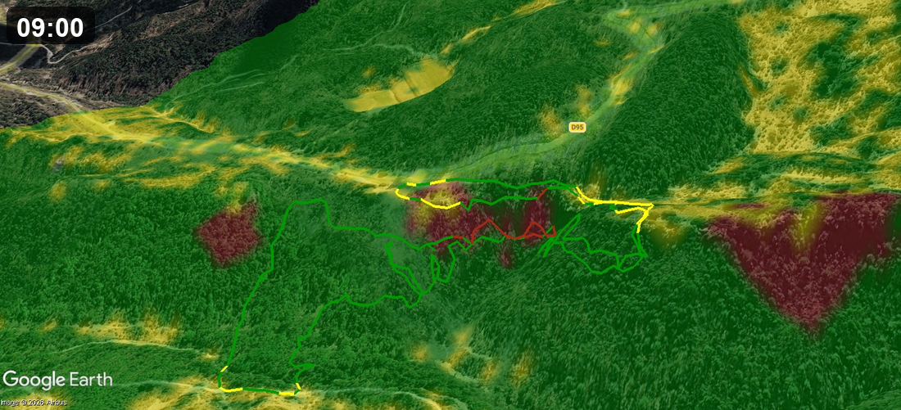
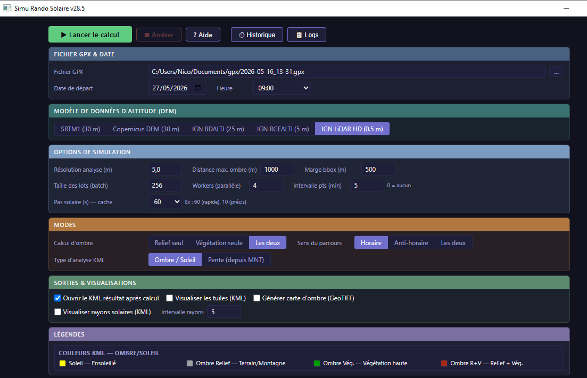
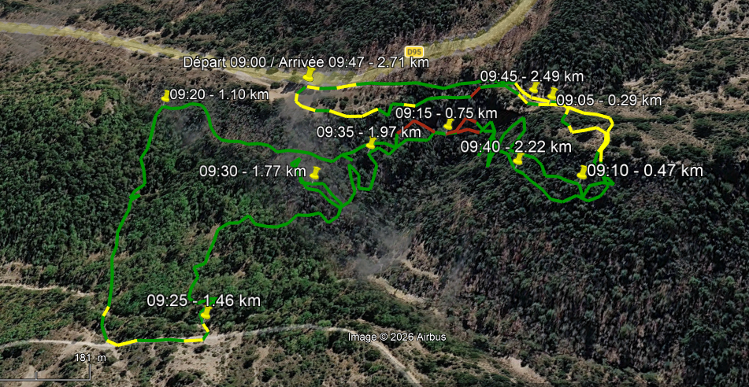
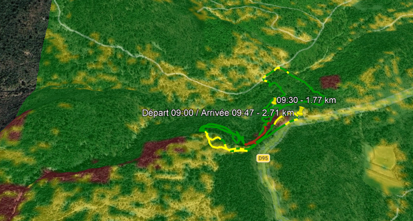
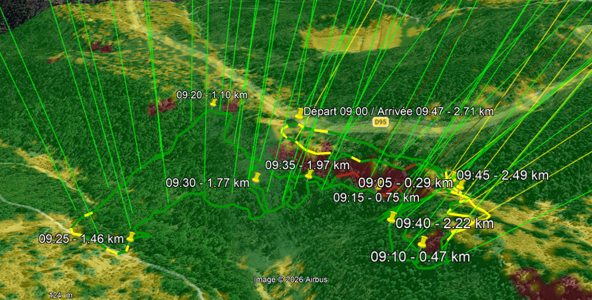

# gpxsolar

### Serai-je au soleil ou à l'ombre sur ma rando ?

gpxsolar lance un rayon vers le soleil depuis **chaque point** d'une trace GPX et
le teste contre le relief **et** la végétation (LiDAR HD 0,5 m / IGN), pour une
date et une heure données. Il te dit, mètre par mètre, soleil ou ombre.



> *Will I be in sun or shade on my hike?* gpxsolar ray-traces the sun against
> terrain **and** vegetation (0.5 m LiDAR) along a GPX track, for a given date
> and time — point by point, sun or shade.

**Sorties : KMZ (Google Earth), overlay MBTiles + trace KML (Locus Map / OsmAnd) et CSV.**

Script Python autonome qui prend une trace GPX, une date et une heure de départ,
puis calcule pour chaque point du parcours s'il est au soleil ou à l'ombre, en
tenant compte du relief (modèle numérique de terrain) et de la végétation
(ESA WorldCover). Il produit un KML/KMZ colorisé à ouvrir dans Google Earth et
un récapitulatif CSV.

> ⚠️ **Statut** : usage personnel diffusé. Développé et testé sur Windows 10/11.
> Linux et macOS sont supportés par l'architecture de build mais testés
> partiellement — cas connus + dépannage cross-OS dans la section *Dépannage*
> de [BUILD.md](BUILD.md). Retours bienvenus via les
> [issues GitHub](https://github.com/nico579/gpxsolar/issues).

---

## Ce que ça produit

À partir d'un fichier GPX + date/heure :

- **Profil d'ensoleillement** le long de la trace : chaque point est classé
  *soleil* / *ombre* en simulant la position du soleil (azimut + hauteur via
  `pysolar`) et en projetant un rayon contre le relief et la canopée.
- **Ombres de relief** depuis un MNT, avec plusieurs sources d'altitude au choix :
  - **SRTM1 / Copernicus DEM** — mondial, basse/moyenne résolution
  - **IGN BD ALTI 25 m** — France, moyenne résolution
  - **IGN RGE ALTI 5 m** — France, haute résolution
  - **IGN LiDAR HD 0.5 m** — France, très haute résolution (MNT, MNS, MNH)
- **Ombres de végétation** via ESA WorldCover (hauteur de canopée estimée),
  désactivables.
- **Sorties** : KMZ colorisé (Google Earth), overlay **MBTiles** + trace **KML**
  pour les apps GPS smartphone (Locus Map, OsmAnd…), et CSV agrégé. Option de
  points de passage horodatés tout au long du parcours.
  Détail des fichiers et superposition smartphone : section
  [Fichiers de sortie](#fichiers-de-sortie--superposition-smartphone).

---

## Installation et utilisation

Deux façons d'utiliser gpxsolar :

| | **A. Script Python** | **B. Exécutable autonome** |
|---|---|---|
| **Prérequis** | Python 3.12 | Aucun |
| **Première install** | ~5 min (bootstrap deps) | Aucun |
| **Mises à jour** | `git pull` + relance | Patcher le bundle en une commande : `python update_app.py` (ou `--release` pour les 3 OS — voir [`update_app.py`](update_app.py)) |
| **Distribuable** | Non — chaque utilisateur installe Python | Oui — `.exe` / `.app` / binaire Linux + `gpxsolar_bundle.zip` côte à côte |
| **Idéal pour** | dev / Linux / contribuer | utilisateur final / distribuer |

### A. Script Python

Au premier lancement, le script crée `~/.gpxsolar/venv` et y installe ses
dépendances (numpy, pyproj, rasterio, shapely, pysolar, pywebview + PyQt6/QtWebEngine,
simplekml, timezonefinder, gpxpy, pandas…). ~300-400 Mo, **une seule fois**.

#### Windows 10+
```powershell
git clone https://github.com/nico579/gpxsolar
cd gpxsolar
python gpxsolar.py
```

#### macOS 11+
```bash
brew install python@3.12
git clone https://github.com/nico579/gpxsolar
cd gpxsolar
python3.12 gpxsolar.py
```

#### Linux (Debian / Ubuntu)
```bash
sudo apt install python3.12 python3.12-venv git
git clone https://github.com/nico579/gpxsolar
cd gpxsolar
python3.12 gpxsolar.py
```

Modes de bootstrap : `--bootstrap=auto` (défaut, venv isolé), `--bootstrap=pip`
(install dans le Python courant), `--bootstrap=none` (vérifie seulement),
`--help-bootstrap` (aide).

### B. Exécutable autonome

Pas de Python à installer côté utilisateur final. Le livrable contient son propre
runtime (Python embarqué + dépendances).

#### 1. Obtenir le livrable

**Option a — Télécharger depuis [Releases](https://github.com/nico579/gpxsolar/releases)** :

| OS | Archive | Extraire avec |
|----|---------|---------------|
| Windows 10/11 (x86_64) | `gpxsolar-windows-x86_64.zip` | `Expand-Archive` ou double-clic |
| Linux Ubuntu 24.04+ (x86_64) | `gpxsolar-linux-x86_64.tar.gz` | `tar xzf` |
| macOS 12+ (Apple Silicon) | `gpxsolar-macos-arm64.zip` | `unzip` puis `xattr -dr com.apple.quarantine GPXSOLAR.app` |

L'archive contient le binaire/launcher et son `gpxsolar_bundle.zip` côte à côte.

**Option b — Builder soi-même.** Un script de setup machine (à faire **une fois**)
puis un script de build (à relancer à chaque mise à jour de `gpxsolar.py`).

##### Windows
```powershell
git clone https://github.com/nico579/gpxsolar
cd gpxsolar
.\setup_build_windows.ps1     # 1. Setup : Python 3.12, deps, PyInstaller
.\gpxsolar_win_build.ps1      # 2. Build -> dist\gpxsolar.exe + dist\gpxsolar_bundle.zip
```

##### macOS (Apple Silicon)
```bash
git clone https://github.com/nico579/gpxsolar
cd gpxsolar
bash setup_build_mac.sh       # 1. Setup
bash gpxsolar_mac_build.sh    # 2. Build -> dist/GPXSOLAR.app + dist/gpxsolar-macos-arm64.zip
```

##### Linux (Ubuntu / Debian)
Linux réutilise la spec `gpxsolar_win.spec` (PyInstaller produit un ELF sous Linux,
le nom `_win` est trompeur).
```bash
git clone https://github.com/nico579/gpxsolar
cd gpxsolar
bash setup_build_linux.sh       # 1. Setup
bash gpxsolar_linux_build.sh    # 2. Build -> dist/gpxsolar + dist/gpxsolar_bundle.zip
```

Documentation complète du build (architecture du bundle, mise à jour sans rebuild,
dépannage) : **[BUILD.md](BUILD.md)**.

#### 2. Lancer le livrable

| OS | Commande |
|----|----------|
| Windows | Double-clic sur `gpxsolar.exe` (ou terminal pour voir le log) |
| Linux | `chmod +x gpxsolar && ./gpxsolar` dans le dossier extrait |
| macOS | Double-clic sur `GPXSOLAR.app`. 1er lancement bloqué par Gatekeeper : `xattr -dr com.apple.quarantine GPXSOLAR.app` puis double-clic |

Le premier lancement extrait le bundle (~20-30 s, une fois — il contient Qt) dans :
- Windows : `%LOCALAPPDATA%\gpxsolar\`
- macOS : `~/Library/Application Support/gpxsolar/`
- Linux : `~/.local/share/gpxsolar/`

Désinstallation propre : `gpxsolar(.exe) --desinstaller` (supprime le bundle
extrait + le venv).

---

## Utilisation

Deux modes, sélectionnés automatiquement selon les arguments (même logique que
le projet jumeau [lidar2map](https://github.com/nico579/lidar2map)) :

- **Sans argument → interface graphique** (pywebview). Mode courant.
- **Avec arguments → calcul en ligne de commande** (headless, sans fenêtre).
  Pratique pour scripter, lancer sur un serveur, ou reproduire un rendu précis.

### Mode interface graphique (sans argument)

| Plateforme | Lancer |
|---|---|
| **Windows** | double-clic sur **`gpxsolar.exe`** (ou en terminal pour voir le log) |
| **Linux** | **`./gpxsolar`** dans le dossier extrait |
| **macOS** | double-clic sur **`GPXSOLAR.app`** |
| Script (dev) | `python gpxsolar.py` |

Puis dans la fenêtre :
1. Choisissez un fichier **GPX**.
2. Sélectionnez **date** et **heure de départ**.
3. Choisissez une **source d'altitude** : SRTM/Copernicus (mondial), IGN ALTI
   (France), IGN LiDAR HD (France, MNT/MNS/MNH).
4. Réglez les options (type d'ombre, végétation, résolution d'analyse).
5. **Lancez le calcul** → KML/KMZ + CSV.

### Mode ligne de commande (headless)

Dès qu'on passe un argument, gpxsolar calcule **sans ouvrir de fenêtre** et écrit
les sorties dans `GPX_Ombres/` (KMZ / MBTiles / KML selon les options — voir
[Fichiers de sortie](#fichiers-de-sortie--superposition-smartphone)), plus le CSV. Le minimum requis est
`--gpx` + `--date` (JJ/MM/AAAA) + `--time` (HH:MM). Tout ce qui suit vaut pour le
binaire comme pour le script — remplacez simplement `gpxsolar.exe` par
`./gpxsolar` (Linux) ou `python gpxsolar.py` (dev).

Les trois commandes ci-dessous reproduisent exactement les trois rendus
Google Earth de la section [Captures d'écran](#captures-décran) :

```powershell
# 1) Tracé coloré soleil / ombre (rendu de base)
gpxsolar.exe --gpx rando.gpx --date 21/06/2024 --time 09:00 --dem-source ign_lidar_hd

# 2) + fond de carte (carte d'ombre raster en KMZ)
gpxsolar.exe --gpx rando.gpx --date 21/06/2024 --time 09:00 --dem-source ign_lidar_hd `
             --generate-shadow-map

# 3) + rayons solaires simulés
gpxsolar.exe --gpx rando.gpx --date 21/06/2024 --time 09:00 --dem-source ign_lidar_hd `
             --generate-shadow-map --visualize-sun-rays --sun-ray-interval 20
```

> Le backtick `` ` `` est la continuation de ligne PowerShell. Sous Linux/macOS,
> utilisez `\` ou mettez tout sur une seule ligne.

---

## Fichiers de sortie & superposition smartphone

Toutes les sorties atterrissent dans `GPX_Ombres/`. Le préfixe `<base>` encode
le GPX, la date, l'heure, la source d'altitude, le type d'ombre et le sens.

**Sans `--generate-shadow-map`** (tracé seul) :

| Fichier | Contenu | Pour |
|---|---|---|
| `<base>.kml` | trace colorée soleil/ombre (vectorielle) | Google Earth, Locus, OsmAnd, QGIS |

**Avec `--generate-shadow-map`** (tracé + carte d'ombre) — trois fichiers, un par usage :

| Fichier | Contenu | Pour |
|---|---|---|
| `<base>.kmz` | **tout-en-un** : trace colorée **+** carte d'ombre | **Google Earth** (desktop) |
| `<base>.mbtiles` | carte d'ombre seule, **overlay raster** (tuiles PNG, Web Mercator) | **Locus Map / OsmAnd / OruxMaps / QGIS** |
| `<base>_trace.kml` | trace colorée seule (vectorielle) | **Locus Map / OsmAnd** (comme *track*) |

Plus le **CSV** récapitulatif (`analyse_solaire.csv` par défaut), une ligne par run.

### Pourquoi trois fichiers et pas un seul

Google Earth lit le **KMZ** (image d'ombre + trace fusionnées) sans souci. Mais
les apps smartphone gèrent mal le GroundOverlay KML : on leur fournit donc la
carte d'ombre au format **MBTiles** (le standard d'overlay raster qu'elles
savent toutes afficher) et la trace en **KML** séparé.

### Superposer ombre + trace sur smartphone (Locus Map, OsmAnd)

Le réflexe « je ne peux activer qu'**un** overlay-carte » est exact — mais une
app GPS a **trois couches indépendantes** :

1. le **fond de carte** (topo, satellite…) ;
2. **un** overlay-carte par-dessus → c'est le **`.mbtiles`** d'ombre ;
3. autant de **tracks/itinéraires** qu'on veut → c'est le **`_trace.kml`**.

Un *track* n'est **pas** une « carte » : il ne compte pas dans la limite d'un
seul overlay. On charge donc l'ombre **et** la trace comme **deux couches de
nature différente**, et elles s'affichent ensemble.

**Locus Map :**
- *Ombre* : copier `<base>.mbtiles` dans `Locus/mapItems/` (ou `Locus/maps/`),
  puis l'activer comme **overlay** (gestionnaire de cartes → bouton overlay).
  **Laisser l'opacité du calque à 100 %** (voir l'encadré ci-dessous).
- *Trace* : **importer** `<base>_trace.kml` → elle apparaît comme **track**,
  nette et cliquable, par-dessus l'overlay.

**OsmAnd :**
- *Ombre* : *Configurer la carte → Couche de carte en superposition* → choisir
  le `.mbtiles`. **Laisser la transparence du calque au maximum / à 0 %.**
- *Trace* : *Mes données / Pistes* → **importer** le `.kml` (ou `.gpx`).

> **Laisse l'opacité du calque à 100 % dans Locus/OsmAnd.** La semi-transparence
> est déjà **bakée dans les tuiles** (l'ombre laisse voir le fond topo) — rien à
> régler. Baisser l'opacité **du calque** ne fait qu'accentuer un artefact de
> Locus.
>
> **Coutures de tuiles fines dans Locus :** Locus dessine les tuiles d'un overlay
> semi-transparent avec un léger recouvrement, ce qui laisse de **fines lignes**
> aux bords de tuiles. C'est une **limite de rendu de Locus** (indépendante du
> format : MBTiles, RMAP ou SQLitedb donnent la même chose), pas un défaut des
> données — les tuiles sont contiguës au pixel près. **QGIS et Google Earth
> rendent sans couture.** Pour le SIG, préfère de toute façon le GeoTIFF
> (EPSG:2154) ou le MBTiles ouvert dans QGIS.

Principales options (liste complète : `gpxsolar.exe --help`) :

```
--gpx CHEMIN                     # fichier GPX (déclenche le mode ligne de commande)
--date JJ/MM/AAAA --time HH:MM   # date et heure de départ
--dem-source {srtm1,copernicus,ign_bdalti_25m,ign_rgealti_5m,ign_lidar_hd}
--shadow-mode {relief,vegetation,both}      # type d'ombre (défaut: both)
--direction {CW,CCW,both}        # sens de parcours simulé (défaut: both)
--generate-shadow-map            # carte d'ombre raster (fond de carte) en KMZ
--visualize-sun-rays             # dessiner les rayons solaires
--visualize-tiles                # dessiner les dalles/tuiles DEM utilisées
--sun-ray-interval 20            # espacement des rayons solaires
--analysis-resolution 5.0        # pas d'échantillonnage du calcul d'ombre (m)
--max-shadow-distance 1000       # portée max de détection d'ombre (m)
--passage-interval-min 0         # points de passage horodatés (0=aucun)
--no-vegetation-shadow           # ignorer l'ombre de la végétation
--no-download-vegetation         # ne pas télécharger WorldCover
--output analyse_solaire.csv     # nom du CSV de sortie
--open                           # ouvrir le résultat à la fin (Windows)
```

---

## Captures d'écran

### Interface graphique

Formulaire pywebview : choix du GPX, date et heure de départ, source d'altitude
(SRTM / Copernicus / IGN ALTI / IGN LiDAR HD), type d'ombre et options.



### Rendu dans Google Earth

Le tracé GPX colorisé soleil / ombre le long du parcours, avec le relief, le fond
de carte et les rayons solaires simulés.

| Tracé coloré soleil/ombre | + fond de carte | + rayons solaires |
|---|---|---|
|  |  |  |

---

## Documentation

- **README utilisateur** : ce fichier
- **Build & déploiement** : [BUILD.md](BUILD.md) — architecture du bundle, scripts par OS, mise à jour sans rebuild, dépannage (incluant cas spécifiques Linux et macOS)
- **Aide intégrée** : `python gpxsolar.py --help`

## Licence

Code distribué sous **GNU General Public License v3.0** — voir [LICENSE](LICENSE).
Vous êtes libre d'utiliser, modifier et redistribuer selon les termes de la GPL v3.

## Auteur

Conçu et architecturé par **Nicolas Martin** ([@nico579](https://github.com/nico579)).
Code développé avec l'assistance de Claude (Anthropic) comme outil de développement.

## Remerciements

Données et outils :
- **IGN** — BD ALTI, RGE ALTI, LiDAR HD (licence Etalab 2.0)
- **NASA / USGS** — SRTM ; **Copernicus** — DEM GLO-30
- **ESA WorldCover** — couverture du sol / végétation
- Bibliothèques : pysolar, pyproj, rasterio, shapely, numpy, pandas, gpxpy,
  simplekml, timezonefinder, pywebview, Pillow, numba.
